# Setup SAP Event Mesh as your eventing backend for Kyma Runtime

## Setup steps

### 1. Add the required entitlements to your SAP BTP subaccount

1. In your BTP subaccount, select `Entitlements` -> `Configure Entitlements`.

   

2. Select `Add Service Plans`.

   

3. Search for `Event Mesh`. Then, select its `default` and `standard (Application)` plans and select `Add 2 Service Plans`.

   

4. Save your changes by selecting `Save`.

   

### 2. Create an instance of SAP Event Mesh service in your Kyma Runtime (default plan)

1. Go to your Kyma workspace and select `Namespaces`. Then, select your namespace. For example, select the `cdc` namespace.

   

2. Select `Service Management` -> `Catalog` -> Search for `Event Mesh` and select `Event Mesh`.

   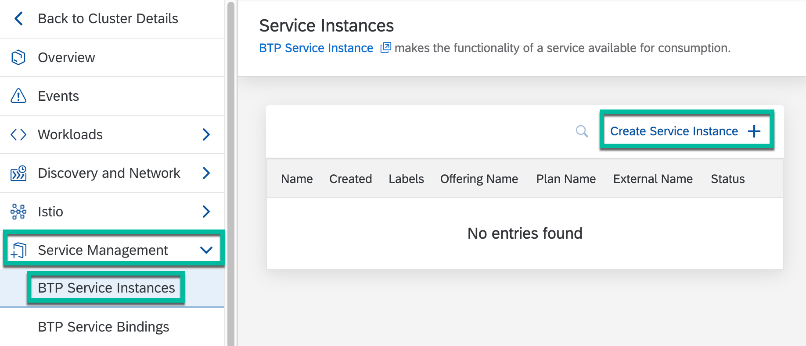

3. Select `Add`.

   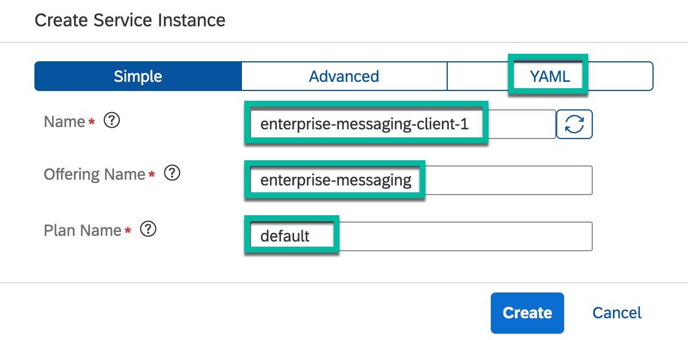

4. Enter the name of the instance as `enterprise-messaging-client-1`. Select the `default` plan and select `Add parameters`.

   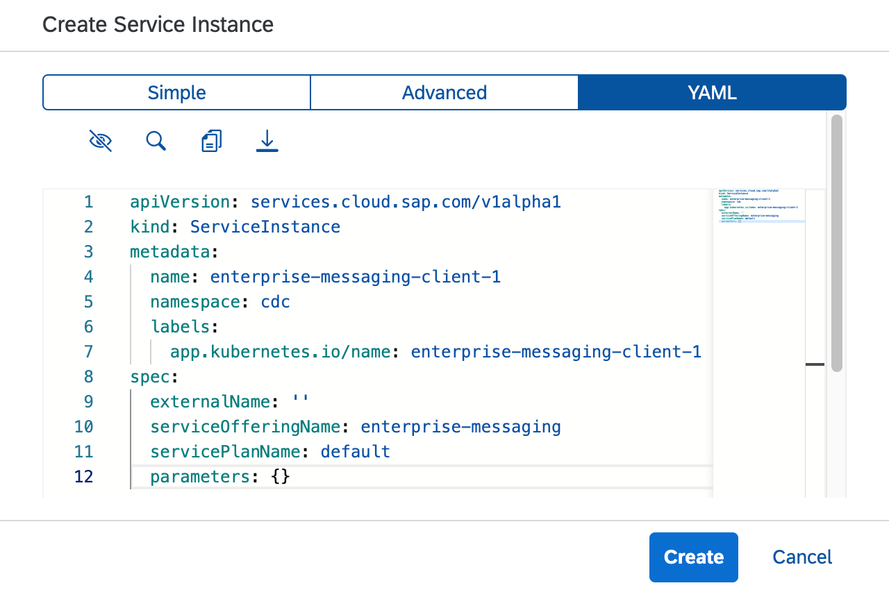

5. Copy and paste the following JSON code snippet into the parameters field.

   ```shell
   {
      "options": {
         "management": true,
         "messagingrest": true,
         "messaging": true
      },
      "rules": {
         "topicRules": {
               "publishFilter": [
                  "${namespace}/*"
               ],
               "subscribeFilter": [
                  "${namespace}/*"
               ]
         },
         "queueRules": {
               "publishFilter": [
                  "${namespace}/*"
               ],
               "subscribeFilter": [
                  "${namespace}/*"
               ]
         }
      },
      "version": "1.1.0",
      "emname": "enterprise-messaging-client-1",
      "namespace": "default/sap.kyma.custom/cdc.1"
   }
   ```

6. Review the JSON code snippet to ensure that the value of `emname` is the same as the instance name. Then, select Create.

   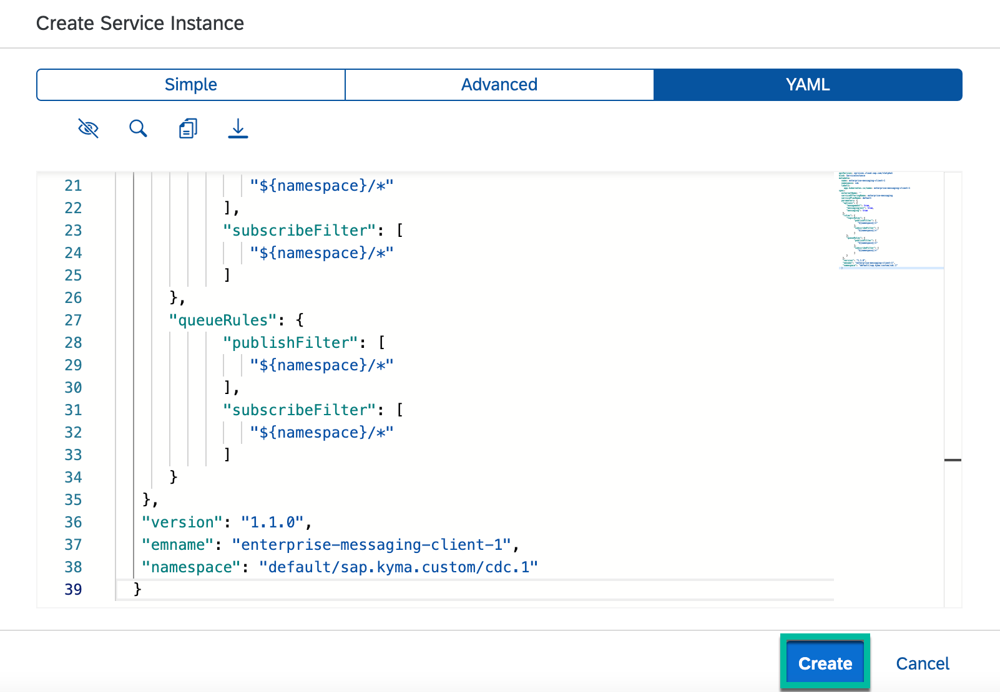

7. Wait for the status of the service instance to change to `PROVISIONED`. Then, select `Add Service Binding`.

   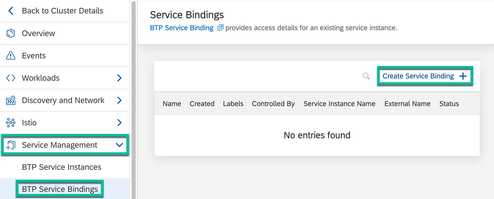

8. For `Name` enter `enterprise-messaging-client-1-binding` and for `Secret Name` enter `enterprise-messaging-client-1-secret`. Then, select `Create`.

   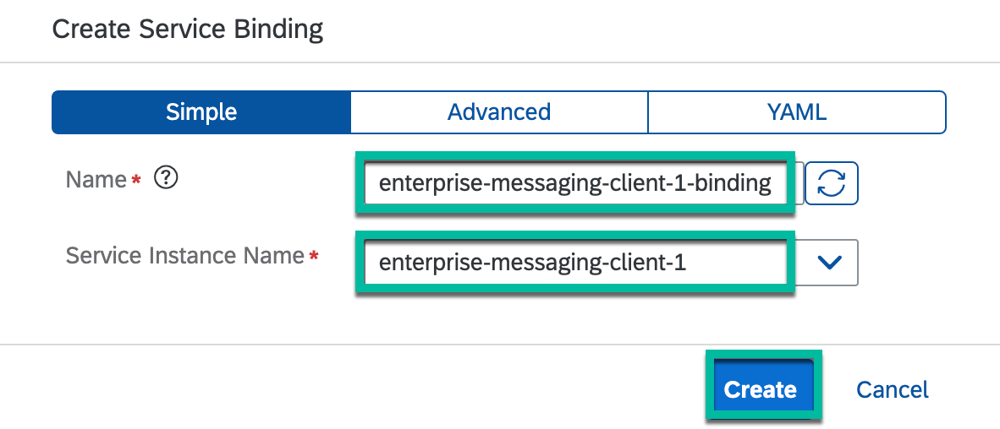

### 3. Switch the default eventing of Kyma Runtime from NATS to SAP Event Mesh

1. After the previous step, wait for the status of the service instance binding to change to `READY`. Then, select the Secret name. For example, `enterprise-messaging-client-1-secret`.

   

2. Select `Edit`.

   

3. Select the `YAML` tab.

   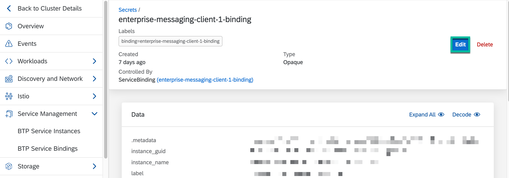

4. Enter the following YAML code snippet to add the `kyma-project.io/eventing-backend: beb` label to the Secret. Then, select `Update`.

   ```shell
   labels:
     kyma-project.io/eventing-backend: beb
   ```

   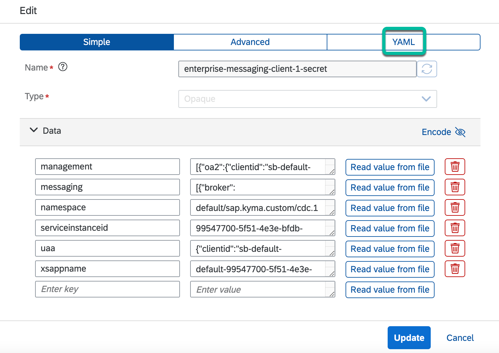

## Optional steps to setup SAP Event Mesh Enterprise Messaging application in your SAP BTP cockpit

> **Note:** The following steps are optional and allow you to view, manage and monitor the SAP Event Mesh Enterprise Messaging application within your SAP BTP cockpit.

## 1. Create a subscription for SAP Event Mesh service in your SAP BTP account (standard plan)

1. Within your BTP subaccount, go to **Services** > **Service Marketplace**, search for **Event Mesh** and click **Create**.

   

2. Select the **standard** plan and click **create**.

   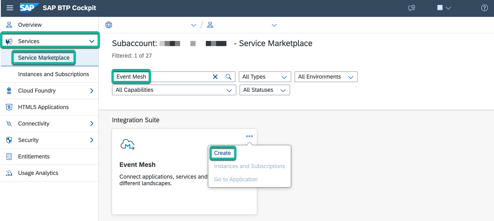

## 2. Assign the required Role Collections to the admin user

1. Assign the required Role Collections to the admin user. In your BTP subaccount, select `Security` -> `Users`. Search for your user. Then, select the right arrow below the `Actions' column.

   

2. Scroll down and click on the three dots below `Role Collections`. Then select `Assign Role Collection`.

   

3. Select all the following options and select `Assign Role Collection`.

   * Enterprise Messaging Administrator
   * Enterprise Messaging Developer
   * Enterprise Messaging Display
   * Enterprise Messaging Subscription Administrator
   * Event Mesh Integration Administrator

   

## 3. Navigate to the SAP Event Mesh Enterprise Messaging application

1. Go to `Services` -> `Instances and Subscriptions` and select the `Event Mesh` application.

   

2. Select `kyma-enterprise-messaging-client`.

   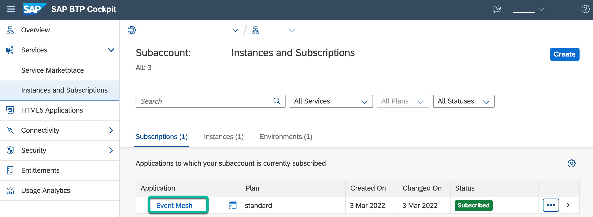

3. Navigate through the various tabs and explore the user interface of the SAP Event Mesh Enterprise Messaging application.

   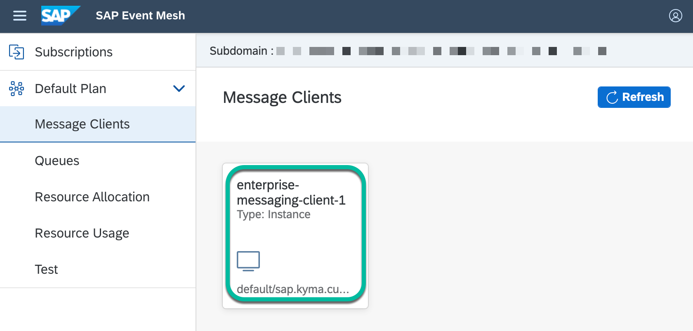

## Refer to the following documentation page for more information :arrow_lower_right&#58;

### [Use Kyma Eventing with SAP Event Mesh](https://help.sap.com/products/BTP/65de2977205c403bbc107264b8eccf4b/407d1266017f4b529b61665fa7408c41.html)

## Navigation

| [:house:](../../README.md) | :arrow_backward: [Setup : Step 6 - Apply the Webhook Event Subscription](step-6.md) | :arrow_forward: [Verification : Step 1 - Verify that all the resources of the app are running](../verification/step-1.md) |
| -------------------------- | --------------------------------------------------------------------------------- | ---------------------------------------------------------------------------------- |
