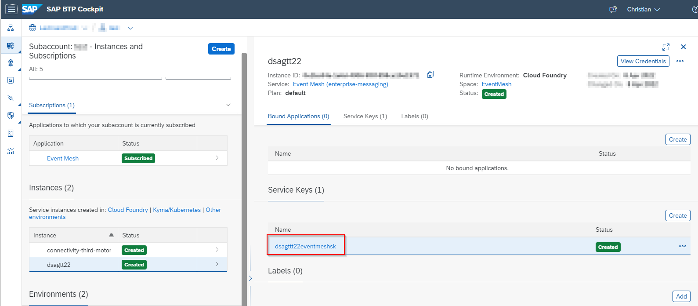
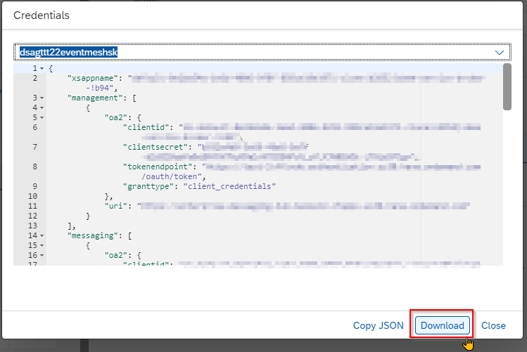

# Step 4 - Set up the SAP Event Mesh

> DSAG Technologietage 2022 Category: 👨‍🔧, steps 4.1 to 4.4 are 👀

## Goal 🎯

This step covers the setup of the event mesh on SAP BTP, i.e.:

- Provisioning the components (service and application)
- Setting up the message queues
- Retrieving the Service Keys

## Option 1 - Setup in SAP BTP Cockpit

This option guides you through the setup of the SAP Event Mesh via the SAP BTP Cockpit.

### Option 1 | Step 4.1 - Enable the SAP Event Mesh Entitlement
> DSAG Technologietage 2022 Category: 👀

- Within your global account…
- Choose **Entitlements -> Entity Assignments**
- Search **for Event Mesh**
- Choose **standard (Application)** for the plan
- Choose **Add 1 Service Plan**
- Choose **Save**
- Search **for Event Mesh**
- Choose **default** for the plan
- Choose **Add 1 Service Plan**
- Choose **Save**

> 📝 **Tip** - Make sure that you have a Cloud Foundry space for the deployment of the service. If this is not the case create a space via the SAP BTP cockpit in the subaccount where you want  (**Cloud Foundry** -> **Spaces** -> **Create Space**).

In order to be able to interact with the Event Mesh you must now setup the Event Mesh application including the assignment of the corresponding roles to your user

### Option 1 | Step 4.2 - Subscribe to the Event Mesh application
> DSAG Technologietage 2022 Category: 👀

- Navigate to your subaccount in the SAP BTP Cockpit
- Go to **Services** -> **Instances and Subscriptions**
- Click **Create**
- Select **Event Mesh** and the **standard application** plan
- Click **Create**

You find the link to the Administration UI for the Event Mesh in the section **Services** -> ***Instances and Subscriptions** in the **Application area**:


### Option 1 | Step 4.3 - Assign the roles for the Event Mesh application
> DSAG Technologietage 2022 Category: 👀

- Go to the user overview in your subaccount (**Security** -> **Users**)
- Select your user
- In the **Role Collections** section choose the action **Assign Role Collection** from the detail view
- Assign the following roles to your user:
  - **Enterprise Messaging Administrator**
  - **Enterprise Messaging Developer**
  - **Enterprise Messaging Subscription Administrator**
- Save your changes

You have now the right roles to access the UI for the Event Mesh. The last thing that needs to be done is to subscripe to the Event Mesh application

### Option 1 | Step 4.4 - Create the event mesh service

- Navigate to your subaccount in the SAP BTP Cockpit
- Go to **Services** -> **Instances and Subscriptions**
- Choose **Create**
- Select **Event Mesh** and the **default** service plan.
- Select your Cloud Foundry space where you want to deploy the service
- Enter the **Instance Name**: `dsagtt22<userID>`
- Choose **Next**
- Enter the parameters of the service via JSON:

  ```JSON
  {
    "emname": "dsagtt22<userID>",
    "namespace": "default/dsagtt22<userID>.kyma/eventing.demo",
    "version": "1.1.0",
    "options": {
        "management": true,
        "messagingrest": true,
        "messaging": true
    },
    "rules": {
        "queueRules": {
            "publishFilter": [
                "${namespace}/*"
            ],
            "subscribeFilter": [
                "${namespace}/*"
            ]
        },
        "topicRules": {
            "publishFilter": [
                "${namespace}/*"
            ],
            "subscribeFilter": [
                "${namespace}/*"
            ]
        }
    }
  }
  ```

- Choose **Create**

### Option 1 | Step 4.5 - Create the message queues

We now need to create two message queues for your application:

- One for the messages due to the supply chain shortage
- One for the messages that should trigger the outbound communication to the customers because of the delayed order

To do so, execute the following steps:

- Open to the Event Mesh application via the link from the previous section.
- Click on the tile that represents the Event Mesh service instance called `dsagtt22<userID>`.
- Go to the section `queues`
- Click the **Create Queue** button and enter the following data to create the queue for messages due to the supply chain shortage (exchange the "userID" with your ID):
  - **Queue Name**: `supplychainissue<userID>`
  - Leave the default values for the other fields
  - Press the **Create** button
- Click the **Create Queue** button and enter the following data to create the queue for messages that should trigger the outbound communication to the customers because of the delayed order:
  - **Queue Name**: `delayedorder<userID>`
  - Leave the default values for the other fields
  - Press the **Create** button

The result should look like this:


This finalizes the setup of the Event Mesh, we will later come back to the application to add web hooks for the consumption of the messages. In order to be able to push messages to the queue, we need to get the service keys which is described in section [Retrieve Service Keys](#retrieve-service-keys).

## Option 2 - Setup via the BTP Setup Automator

To provision the event mesh you can also use the [BTP setup automator](https://github.com/SAP-samples/btp-setup-automator). You find a description on how to use this tool as well as predefined configuration files in the directory [dsag/2022-technologydays](https://github.com/SAP-samples/btp-setup-automator/tree/main/usecases/other/dsag/2022-technologydays) of the GitHub Repository.

## Retrieve Service Keys

To enable the communication with the event mesh we need to fetch the service keys in order to authenticate requests. 

> 📝 **Tip** - If you used the BTP setup automator to provision the SAP Event Mesh service and application, the service keys are already created by the tool. You can directly download the keys.

You create the keys in the SAP BTP Cockpit:

- Navigate to your subaccount in the SAP BTP Cockpit
- Go to **Services** -> **Instances and Subscriptions**
- In the section **Instances** press the action menu (three dots) of the line item `dsagtt22<userID>` and select **Create Service Key**
- Enter a name for the service key (e. g. `dsagttt22eventmeshsk-<userID>`) and press **Create**

Download the created service key:

- Click on the link of the created service key

  

- Press the ***Download** button in the pop-up window to download the information:  

  

You have now the relevant information to communicate with the Event Mesh i.e. to push messages to the message queues.

## Summary

🎉 Congratulations - You've now completed the setup and configuration of the Event Mesh!

Continue to [Step 5 - Develop function "trigger supply chain issue"](step5.md).

[◀ Previous step](step3.md) | [🔼 Overview](../README.md) | [Next step ▶](step5.md)
