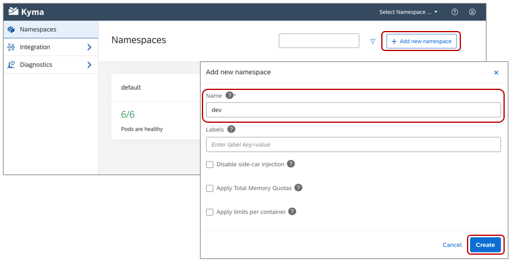
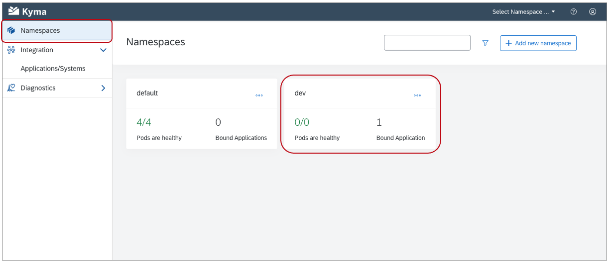
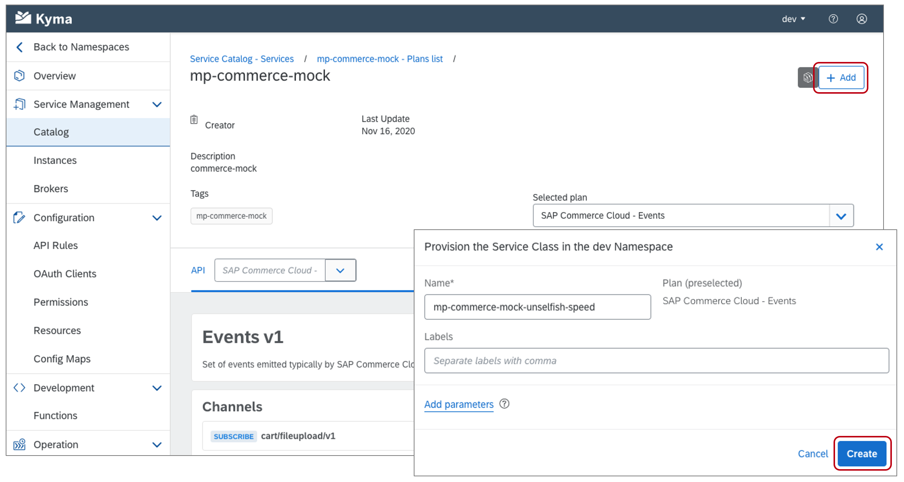
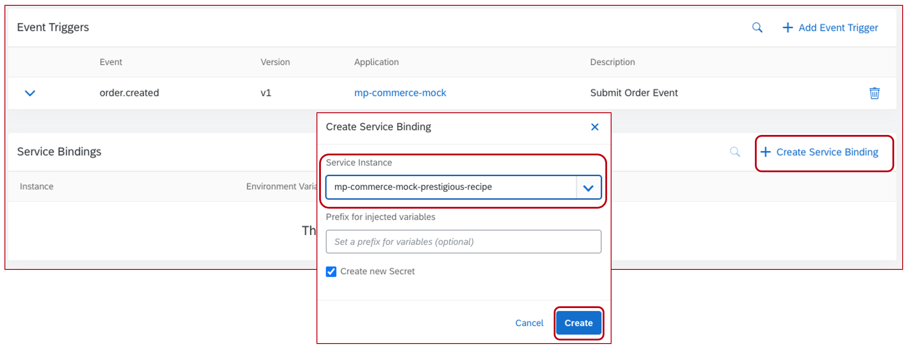

## Overview

work in progress...

This sample provides a Redis deployment and two serverless functions that interact with it. The function `cache-order` is set to subscribe to an `order.created` event provided by the commerce mock application. Once triggered, the function will perform an API call to obtain additional details regarding the order and then cache the information into Redis. The function `get-order`, exposed as an API, is used to then retrieve the order details from the Redis cache.

This sample demonstrates how to:

- Create a development Namespace using the Kyma Console.
- Deployment of Redis using the Kyma Console which includes:
  - A Service to expose Redis to other Kubernetes resources.
  - A Secret containing the Redis password.
- Deployment of the two serverless functions using the Kyma Console.
- Binding of Services to serverless functions.

## Prerequisites

- [Provision Kyma](https://developers.sap.com/tutorials/cp-kyma-getting-started.html)
- [Setup Mock Application](https://developers.sap.com/tutorials/cp-kyma-mocks.html)

## Steps

### Create `dev` namespace

### Bind Commerce Mock Application to `dev` Namespace

### Create Service Instances

1. Open `dev` namespace

2. Open the Service Catalog
3. Choose the tile `mp-commerce-mock`

4. Choose Service Instance for Events

5. Add Service Instance for Events

6. Open the Service Catalog
7. Choose the tile `mp-commerce-mock`

8. Choose Service Instance for OCC

9. Add Service Instance for OCC

### Deploy Resources

- /k8s/cache-order.yaml
- /k8s/get-order.yaml
- /k8s/redis-deployment.yaml

### Add Event

1. Open Function `cache-order`
2. Choose the Configuration tab
3. Choose Event Triggers
4. Choose order.created event
5. Choose Add

### Bind Service

1. Open Function `cache-order`
2. Choose Configuration
3. Choose Create Service Binding
4. Choose the Service instance created in the previous step
5. Choose Create

### Adjust Code

1. Choose the `Code` tab
2. On line three replace the value `<REPLACE WITH GATEWAY_URL>` with the `GATEWAY_URL` found in the Environment Variables
3. Choose `Save`

### Test the Event consumption

With the configuration steps completed, you can now test the scenario to validate that it is working as intended.

1. Open the mock application in the browser by choosing **Configuration > `APIRules`** from the menu.

2. Choose the **Host** entry for the **commerce-mock** `APIRule` to open it in the browser. This URL should be similar to:
   `https://commerce.*******.kyma.shoot.live.k8s-hana.ondemand.com`

3. Choose the **Remote APIS** tab.

   

4. Choose the **SAP Commerce Cloud - Events** option.

5. For the **Event Topics**, choose **order.created.v1**.

6. Modify the `orderCode` value as desired and choose **Send Event**.

   

### Review output in funciton Logs

1. Open the Function `cache-order`
2. Expand the log view at the button of the function viewer
3. Search for the value `orderCode`
4. The output should be similar to:

### Get output from the API-Rule function

1. With the Kyma console, choose **Configuration > `APIRules`** from the menu.
2. Choose the **Host** entry for the **get-order** `APIRule` to open the application in the browser, When first opened you will received the message

   `{"error":"No orderCode received!"}`

3. Append the value `?orderCode=12331231` to the url where the value is the same as used when sending the event, for example

   `https://get-order.*********.kyma-stage.shoot.live.k8s-hana.ondemand.com/?orderCode=12331231`

4. This should output the value saved when the event was submitted.

`{"orderCode":"12331231","Date":"Tue Nov 17 2020 19:28:42 GMT+0000 (Coordinated Universal Time)","Value":"100"}`
