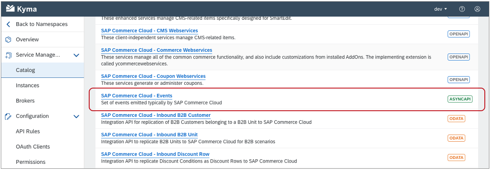
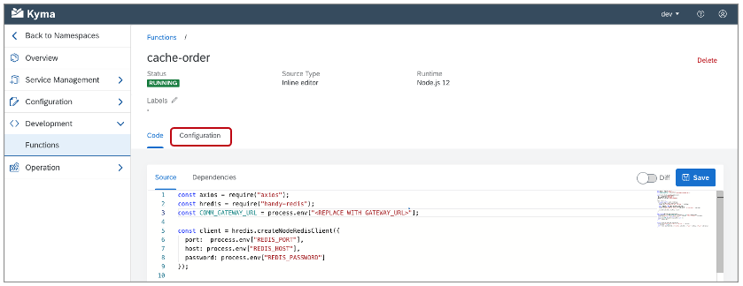
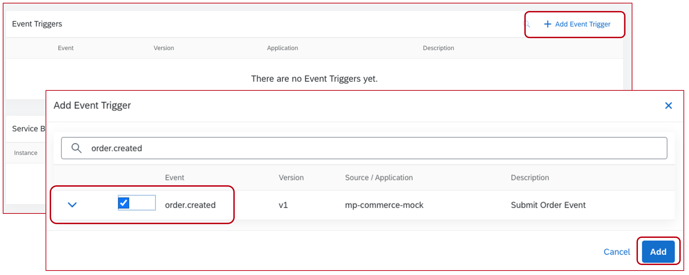
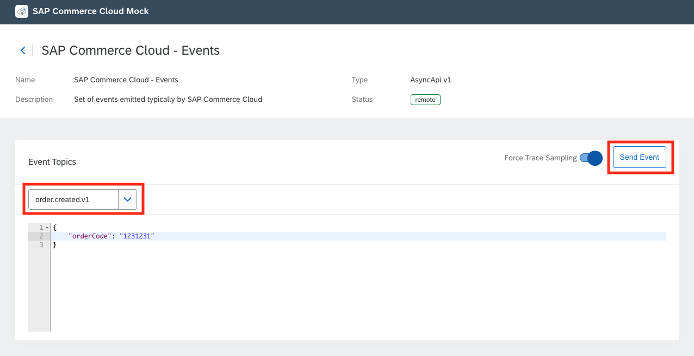

## Overview

work in progress...

This sample provides a Redis deployment and two serverless functions that interact with it. The function `cache-order` is set to subscribe to an `order.created` event provided by the Commerce mock application. Once triggered, the function will perform an API call to the Commerce mock to obtain additional details regarding the order and then cache the information into Redis. The function `get-order`, exposed as an API, is used to then retrieve the order details from the Redis cache.

This sample demonstrates how to:

- Create a development Namespace using the Kyma Console.
- Deployment of Redis using the Kyma Console which includes:
  - A Service to expose Redis to other Kubernetes resources.
  - A Secret containing the Redis password.
- Deployment of the two serverless functions using the Kyma Console.
- Binding of Services to serverless functions.

## Prerequisites

- [Provision Kyma](https://developers.sap.com/tutorials/cp-kyma-getting-started.html)
- [Setup Mock Application](https://developers.sap.com/tutorials/cp-kyma-mocks.html)

## Details

### You will learn
 <!--- Marco: isn't this redundant with the above bullet list? --->
- How to create a Namespace in the Kyma runtime
- How to create Service Instances and bind them to a Servless Function

[ACCORDION-BEGIN [Step 1: ](Clone the Git repository)]

1. Go to the [kyma-runtime-extension-samples](https://github.com/SAP-samples/kyma-runtime-extension-samples) repository. This repository contains a collection of Kyma sample applications which will be used during the tutorial.

2. Download the code by choosing the green **Code** button, and then choosing one of the options to download the code locally.

   You can instead run the following command using your CLI at your desired folder location:

   ```Shell/Bash
   git clone https://github.com/SAP-samples/kyma-runtime-extension-samples
   ```

[ACCORDION-END]
[ACCORDION-BEGIN [Step 2: ](Bind the Application to a Namespace)]

In this step you will bind the Commerce Mock application to the dev namespace. This will allow the APIs and Events of the mock application to be used within the namespace.

1. In the Kyma home workspace, choose **Integration > Applications/Systems**.
2. Choose the **mp-commerce-mock** application by clicking on the name value shown in the list.
3. Choose the option **Create Binding**.
4. In the **namespace** select list choose the option **dev** and then choose **Create**.


[ACCORDION-END]
[ACCORDION-BEGIN [Step 3: ](Create the Events Service Instances)]

In this step you will create service instances of the Events the Commerce Mock application exposes.

1. In the Kyma home workspace, choose **Namespace**.
2. Choose the `dev` namespace.


3. Within the **dev** namespace, choose **Service Managment > Catalog**.

4. Choose the tile **mp-commerce-mock** to view the Service Class Plans of the application.


5. Choose the Service Class Plan for **SAP Commerce Cloud - Events**



6. Choose **Add** the create a Service Instance of the **SAP Commerce Cloud - Events**


[ACCORDION-END]
[ACCORDION-BEGIN [Step 4: ](Create the API Service Instances)]

In this step you will create service instances of the SAP Commerce Cloud - Commerce Webservices.

1. In the **dev** namespace, choose **Service Managment > Catalog**.

2. Choose the tile **mp-commerce-mock** to view the Service Class Plans of the application.


5. Choose the Service Class Plan for **SAP Commerce Cloud - Commerce Webservices**


6. Choose **Add** the create a Service Instance of the **SAP Commerce Cloud - Commerce Webservices**.


[ACCORDION-END]
[ACCORDION-BEGIN [Step 5: ](Deploy Resources)]

In this step you will deploy a Redis database and two Serverless Functions.

1. In the **dev** namespace, choose **Overview**.
2. Choose **Deploy new resource**, using the **Browse** option choose the file **redis-function/k8s/cache-order.yaml** and choose **Deploy**.
3. Repeat the steps to deploy the files **redis-function/k8s/get-order.yaml** and **redis-function/k8s/redis-deployment.yaml**.
 <!--- Marco: would it be better to let people copy-paste functions into the Console? Or maybe have the get-order-function deployed via YAML to have the API rule created and the other one created manually via the UI --->
 


[ACCORDION-END]
[ACCORDION-BEGIN [Step 6: ](Add an Event Trigger to Function)]

In this step you will configure the function cache-order to be triggered when the order.create event is fired from the Commerce Mock application.

1. In the **dev** namespace, choose **Development > Functions**.
2. Choose the function **cache-order**.


3. Choose the tab **Configuration**.



4. In the **Configuration** scroll down and choose **Event Triggers**.
5. Choose the event **order.created** and then choose **Add**



[ACCORDION-END]
[ACCORDION-BEGIN [Step 7: ](Adding a Service Instance to a Function)]

In this step you will add a service instance to the function cache-order which will allow it to easily call the related API.

1. In the function **cache-order**, choose the tab **Configuration**.
2. In the **Configuration** scroll down and choose **Create Service Binding**.
3. Choose the Service instance created in the previous step from the drop down list. The name of your service instance will defer from what is shown in the screenshot.
4. Choose **Create**.


[ACCORDION-END]
[ACCORDION-BEGIN [Step 8: ](Adjust the Function Code)]

1. In the function **cache-order** choose the `Code` tab.
2. On line three, replace the value **<REPLACE WITH GATEWAY_URL>** with the **GATEWAY_URL** found in the Environment Variables below the function code. This value will defer from what is shown in the screenshot.
3. Choose **Save**


[ACCORDION-END]
[ACCORDION-BEGIN [Step 9: ](Test the Event consumption]

With the configuration steps completed, you can now test the scenario to validate that it is working as intended.

1. Open the mock application in the browser by choosing **Configuration > `APIRules`** from the menu.

2. Choose the **Host** entry for the **commerce-mock** `APIRule` to open it in the browser. This URL should be similar to:
   `https://commerce.*******.kyma.shoot.live.k8s-hana.ondemand.com`

3. Choose the **Remote APIS** tab.

   

4. Choose the **SAP Commerce Cloud - Events** option.

5. For the **Event Topics**, choose **order.created.v1**.

6. Modify the `orderCode` value as desired and choose **Send Event**.

   

[ACCORDION-END]
[ACCORDION-BEGIN [Step 10: ](Review Output in Function Logs]

In this step we will view the logs outputted by the function to verify that the scenario is working.

1. In the **dev** namespace, choose **Development > Functions**.
2. Choose the function **cache-order**.
3. Expand the **Log** view at the button of the function viewer
4. Search for the value `orderCode`
5. The output should be similar to:


[ACCORDION-END]
[ACCORDION-BEGIN [Step 11: ](Get output from the API-Rule function]

In this step we use the get-order function to perform a read request of the data cached in the Redis database.

1. Choose **Configuration > `APIRules`** from the menu.
2. Choose the **Host** entry for the **get-order** `APIRule` to open the application in the browser, When first opened you will received the message

   `{"error":"No orderCode received!"}`

3. Append the value `?orderCode=12331231` to the url where the value is the same as used when sending the event, for example

   `https://get-order.*********.kyma-stage.shoot.live.k8s-hana.ondemand.com/?orderCode=12331231`

4. This should output the value saved when the event was submitted.

`{"orderCode":"12331231","Date":"Tue Nov 17 2020 19:28:42 GMT+0000 (Coordinated Universal Time)","Value":"100"}`
