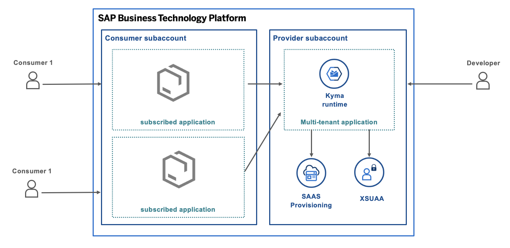

# SAAS Provisioning Sample

## Overview

This sample demonstrates how the SAP SAAS Provisioning service can be used to develop a mulitenant application in the Kyma runtime. When a user subscribes the sample app will generate a number of dedicated k8s resources, with their tenant id appended to the name, for the subscribers subaccount which include:

- A configured deployment based on a generate config map of the [App Auth Proxy](../app-auth-proxy/README.md) to authenticate and authorize the user.
- An API rule to access the application pointing the the app-auth-proxy.
- A configured deployment based on a generate config map of nginx which outputs information regarding the subscriber.
- An external path to https://httpbin.org/ which will output the headers.
- The related services



### Create a new `saas` Namespace

```shell
kubectl create namespace saas
```

### Create XSUAA Service Instance

The XSUAA Service Instance defines how subscribers will authenticate to the sample application. The sample app uses the [App Auth Proxy](../app-auth-proxy)

>> <https://help.sap.com/viewer/4505d0bdaf4948449b7f7379d24d0f0d/2.0.03/en-US/3bfb120045694e21bfadb1344a693d1f.html>

1. Within the Kyma console open the namespace **saas**.
2. Choose **Service Management** -> **Catalog**.
3. Choose the service **Authorization & Trust Management**.
4. Choose **Add**.
5. Choose the Plan **application**.
6. Choose **Add parameters** and provide the object after adjusting the **<cluster domain>** value of the redirect-uris.
7. After the instance is created, choose the **Credentials** tab and choose the option **Create Credentials**.

    ```json
    {
      "xsappname": "saas-provisioning-demo-app",
      "oauth2-configuration": {
        "redirect-uris": [
          "https://*.c-979a4a0.kyma.shoot.live.k8s-hana.ondemand.com/oauth/callback"
        ]
      },
      "tenant-mode": "shared",
      "scopes": [
        {
          "name": "$XSAPPNAME.Callback",
          "description": "With this scope set, the callbacks for tenant onboarding, offboarding and getDependencies can be called.",
          "grant-as-authority-to-apps": [
            "$XSAPPNAME(application,sap-provisioning,tenant-onboarding)"
          ]
        },
        {
          "name": "$XSAPPNAME.User",
          "description": "Use the application"
        }
      ],
      "role-templates": [
        {
          "name": "User",
          "description": "User",
          "scope-references": ["$XSAPPNAME.User"]
        }
      ],
      "role-collections": [
        {
          "name": "saas-provisioning-demo-app-User",
          "description": "My SaaS App User",
          "role-template-references": ["$XSAPPNAME.User"]
        }
      ]
    }
    ```

### Create SAAS Provioning Instance

>> <https://help.sap.com/viewer/65de2977205c403bbc107264b8eccf4b/Cloud/en-US/ff540477f5404e3da2a8ce23dcee602a.html>

1. Choose **Service Management** -> **Catalog**.
2. Choose the service **SaaS Provisioning**
3. Choose **Add**
4. Choose the Plan **application**
5. Choose **Add parameters** and provide the object after adjusting the **<cluster domain>** value of the onSubscription property.

    ```json
    {
      "xsappname": "saas-provisioning-demo-app",
      "displayName": "Kyma SAAS Provisioning Demo",
      "description": "A Kyma SAAS Provisioning Demo Sample App",
      "category": "Kyma Demo",
      "appUrls": {
        "onSubscription": "https://saas-provisioning-demo.c-979a4a0.kyma.shoot.live.k8s-hana.ondemand.com/callback/v1.0/tenants/{tenantId}"
      }
    }
    ```

### Deploy the Sample

The sample app is what will be called when a user subscribes to your application. This sample app will provision resources based on the configmap provided.

When a consumer subscribes to the app the SaaS Provisioning Service will submit a JWT when calling the On-Subscription Endpoint which will be verified by the Kyma Application Gateway based on the values defined in the Issuer and JWKS URI. These values will cause the subscription to fail if the endpoints are not correct for the environment. Adjust the values for the Issuer and JWKS URI of the `apirule.yaml`, for example

- Issuer: http://sap-provisioning.localhost:8080/uaa/oauth/token
- JWKS URI: https://sap-provisioning.authentication.us21.hana.ondemand.com/token_keys

Deploy the the resources found in the directory **K8s** into the `saas` namespace

The `apirule` validates the requests coming from the SAAS Provisioning service and forwards it to the sample app:

```shell
kubectl apply -f ./k8s/apirule.yaml -n saas
```

The config-map contains the struture needed to define the subscribers app. At a minimum you will have to adjust the value of **domain** to match the domain of your Kyma runtime:

```shell
kubectl apply -f ./k8s/config-map.yaml -n saas
```

The sample app deployment:

```shell
kubectl apply -f ./k8s/deployment.yaml -n saas
```

The service account used by the sample app to generate k8s resources:

```shell
kubectl apply -f ./k8s/service-account.yaml -n saas
```

### Bind XSUAA Service Instance to the App

1. Bind the XSUAA Service Instance by first determine the instance name by running:

    ```shell
    kubectl -n saas get serviceinstances
    ```

2. Adjust the value of <Service Instance Name> found in `service-binding.yaml` to the XSUAA service instance name and then apply it:

    ```shell
    kubectl apply -f ./k8s/service-binding.yaml -n saas
    ```

### Subscribe to the App

1. Create another subaccount using the same provider and region as the Kyma runtime containing the SAAS application and open it
2. Choose the Subscriptions menu option
3. Find and open the **Kyma SAAS Provisioning Demo** tile
4. Choose Subscribe

### Configure Access to the App

1. When the subscription completes...
2. Choose **Security -> Trust Configuration** from the subaccount main menu.
3. Choose **SAP ID Service**
4. Provide your email address and choose **Show Assignments**
5. Choose **Assign Role Collection** and choose **saas-provisioning-demo-app-User**

### Access to the App

1. You may have to log out/in for the role assignment to take place.
2. Choose the menu option Subscriptions
3. Find and open the **Kyma SAAS Provisioning Demo** tile
4. Choose the **Go to Application** link.
5. The sample will display
6. The app will have the following endpoints

    - <https://saas-demo-<tenant id&gt;.&lt;cluster domain&gt;/>
    - <https://saas-demo-<tenant id&gt;.&lt;cluster domain&gt;/headers>
    - <https://saas-demo-<tenant id&gt;.&lt;cluster domain&gt;/auth/user>
    - <https://saas-demo-<tenant id&gt;.&lt;cluster domain&gt;/auth/groups>

### Run the Sample Locally

1. Download a Kubeconfig from the Kyma runtime and set envirnoment variable

    ```bash
     export KUBECONFIG=<file path>
    ```

2. Set envirnoment variables

    ```bash
     export IDP_clientid='<client id>'
     export IDP_clientsecret='<client secret>'
     export IDP_url='<url>'
     export IDP_identityzone='<identityzone>'
     export IDP_xsappname='<xsappname>'
    ```

3. Within the folder **cmd/api** run

    ```bash
    go run .
    ```

Send a `PUT` or `DELETE` request to `http://localhost:8000/callback/v1.0/tenants/<a tentant id>` containing

**Header**
Authorization: Bearer < valid jwt containing the saas-provisioning-demo-app\*\*\*\*Callback scope for the app >

**Body**: with valid values

```json
{
  "subscriptionAppName": "",
  "subscriptionAppId": "",
  "subscribedSubaccountId": "",
  "subscribedTenantId": "",
  "subscribedSubdomain": "",
  "globalAccountGUID": "",
  "subscribedLicenseType": "",
  "userId": ""
}
```
