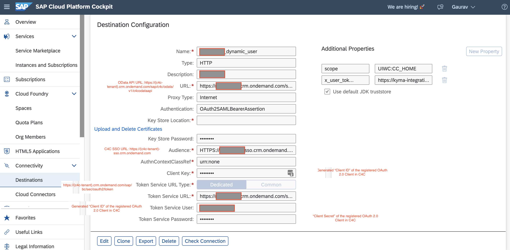
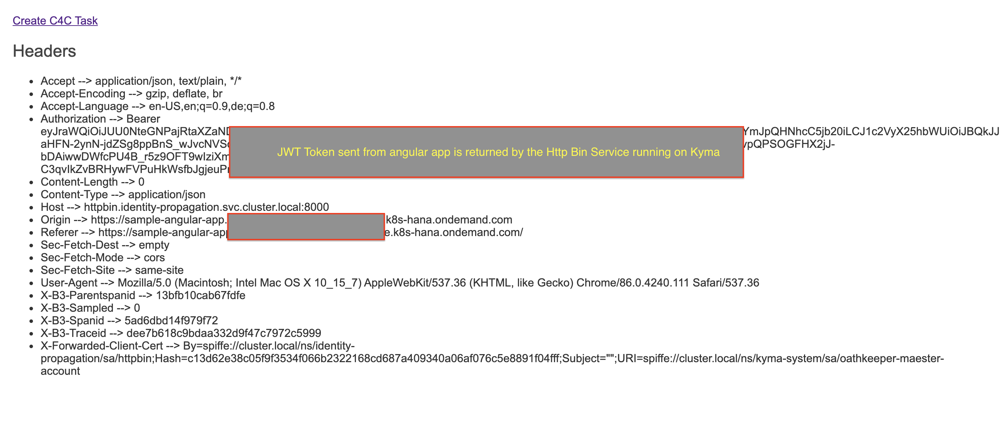

# Overview

This sample demonstrates how a user propagation flow can be achieved when extending SAP Cloud for Customer(C4C) using SAP Cloud Platform, Kyma runtime.

It uses XSUAA with user federation via SAP IAS. However, any external identity provider would also work as long as it supports SAML 2.0.

The JWT token received in Kyma needs to be exchanged for an OAuth2 token that can be authenticated by SAP Cloud for Customer. For this purpose, the [Destination Service](https://help.sap.com/viewer/cca91383641e40ffbe03bdc78f00f681/Cloud/en-US/7e306250e08340f89d6c103e28840f30.html) is used.

## Flow


1. User signs in to C4C with a single ID and password (SSO).
2. C4C redirects the user to IAS for authentication.
3. User signs in to IAS.
4. User is signed in to C4C with SAML bearer assertion.
5. User accesses the Frontend App. The frontend can be a mesh inside C4C or a standalone app hosted on Kyma or somewhere else. The frontend redirects the user to IAS for automatic login. Along with the autologin request, the frontend receives the bearer token.
6. The Frontend App makes an API call to the HTTP Bin app to display the headers.
7. The user creates a task on the Frontend App.
8. The Microservice/Function API receives the user's Token and does the token exchange via the Destination Service. The Destination Service calls C4C and performs the OAuth2 SAML bearer assertion flow.
9. Microservice/Function makes a call to C4C with the OAuth2 token it got from the Destination Service.

## Prerequisites

- SAP Cloud Platform, Kyma runtime instance
- SAP Cloud for Customer tenant
- SAP Cloud Platform Identity Authentication Service tenant
- OAuth 2.0-based authentication between IAS, SAP Cloud Platform, and C4C requires the same user ID to exist in both IAS and C4C.

## Steps

- Setup C4C Single sign-on
- Create Trust Between SCP and IAS
- Setup the User Propagation
- Modify User Identifier
- Create XSUAA instance
- Deploy httpbin Application
- Deploy c4c-extension Application
- Deploy Angular Frontend App
- Deploy Auth Proxy Application

## Configuration

### C4C Single sign-on

Set up single sign-on (SSO) using IAS with C4C. Refer to the [official documentation](https://help.sap.com/viewer/abfba1342cfb4832ab722fa041f6c4b7/CLOUD/en-US/f1e6f23267b542ce9a906823c70dc583.html) for details.

### Create Trust Between SCP and IAS

<sup>Full details can be found at [help.sap.com](https://help.sap.com/viewer/65de2977205c403bbc107264b8eccf4b/Cloud/en-US/7c6aa87459764b179aeccadccd4f91f3.html#loio7c6aa87459764b179aeccadccd4f91f3) </sup>

- In your Identity Authentication service (IAS) tenant download the SAML Metadata file by choosing the menu option **Applications & Resources** -> **Tenant Settings** -> **SAML 2.0 Configuration**. Choose the option to **Download Metadata File**.
- In your SAP Cloud Platform Subaccount choose the menu option **Security** -> **Trust Configuration**. Choose the option **New Trust Configuration** and upload the file downloaded from your IAS tenant in the previous step.
- In your SAP Cloud Platform Subaccount choose the menu option **Security** -> **Trust Configuration**. Choose the option **SAML Metadata** to download the SCP metadata.
- In your Identity Authentication service (IAS) tenant choose the menu option **Applications & Resources** -> **Applications**. Choose **Add**, provide a name and save the application.
- In the IAS application choose **SAML 2.0 Configuration**. Choose the option **Browse** and provide the SAML Metadata file downloaded from SCP. Save the changes.
- In the IAS application choose **Subject Name Identifier** and set the **basic attribute** to use the field which would map to the C4C user. Save the changes.

### User propagation

Configure user propagation between C4C and Kyma runtime.

[This blog](https://blogs.sap.com/2017/11/14/configuring-oauth-2.0-between-sap-hybris-cloud-for-customer-and-sap-cloud-platform/) was used as a reference. It was written for Neo, but some steps are also applicable for Kyma runtime.

You will end up creating a Destination Service in SAP Cloud Platform. It will be later on used by the microservice to do the token exchange.

- Download the `Trust` certificate from **Subaccount** --> **Destinations** --> **Download Trust**.
  

- Log on to your C4C system as an administrator. Go to **ADMINISTRATOR** --> **Common Tasks**. Choose **Configure OAuth 2.0 Identity Provider** and select **New OAuth2.0 Provider**.

  - Get the issuing entity name from the certificate. You can use OpenSSL to view certificate details.

    ```shell script
    openssl x509 -in {cert path} -text -noout
    ```

  - Upload the certificate.
    

- Register an Oauth2 Client in C4C.
  

- Create a destination in SAP Cloud Platform. Under your subaccount, go to **Connectivity** --> **Destinations**.
  

  Configure these additional properties:
  `authnContextClassRef` : `urn:none`
  `scope` : `UIWC:CC_HOME`

### Identifier used by the Destination Service to get the token

The Destination Service uses whatever is specified in the `userIdSource` property. If not specified, it would require either `user_name` or `email` depending upon the `nameIdFormat`
In this example, `user_name` is mapped to the **Login name** attribute.


### Create XSUAA Instance

1. Within the Kyma console open the namespace `dev`
2. Choose `Service Management` -> `Catalog`.
3. Choose the service `Authorization & Trust Management`
4. Choose `Add`
5. Choose the Plan `application`
6. Choose `Add parameters` and provide the object after adjusting it to your needs.

To specify use of only IAS authentication provide the **Origin Key** shown in the Trust Configuration list within SCP for the value of **allowedproviders**, otherwise this property can be omitted to allow either XSUAA or IAS users.

```json
{
  "oauth2-configuration": {
    "allowedproviders": ["<origin key>"],
    "redirect-uris": [
      "https://c4c-user-prop-xsuaa.<cluster domain>/oauth/callback"
    ]
  },
  "xsappname": "c4c-user-prop-xsuaa"
}
```

<sup> For a complete list of parameters visit [Application Security Descriptor Configuration Syntax](https://help.sap.com/viewer/4505d0bdaf4948449b7f7379d24d0f0d/2.0.04/en-US/6d3ed64092f748cbac691abc5fe52985.html) </sup>

1. Once the instance is provisioned choose the option `Create Credentials`
2. Under the `Credentials` tab choose the `Secret` which should display the instance secret in a dialog. Choose `Decode` to view the values. These will be needed if running the sample locally.

### Deploy httpbin Application

httpbin is a service that returns all the request headers to the `/headers` endpoint.

It is used for demonstrating and verifying that the token is forwarded from the API Gateway to the microservice.

- Deploy httpbin.

  ```shell script
  kubectl -n dev apply -f https://raw.githubusercontent.com/istio/istio/master/samples/httpbin/httpbin.yaml
  ```

### Deploy c4c-extension Application

The c4c-extension c4c-extension Application microservice implements the extension logic and performs the user propagation.

- It receives the JWT token that is forwarded from the App Auth Proxy.
- The token is used to do a token exchange via the Destination Service.
- A call is made to C4C to create a task with the exchanged token that contains the user context.
- The task is created with the logged-in user as the processor, not a static user.

#### Setup

- Create a Destination Service instance in the Kyma Service Catalog. This will be used to get the credentials to make the call to the Destination Service.

  

- Create credentials for the instance.

  

- Deploy the extension with user propagation.

  - Update `DESTINATION_NAME` in [`deployment.yaml`](/k8s/c4c-extension/deployment.yaml) with the name of the destination created in SAP Cloud Platform.

  - Deploy the extension.

    ```shell script
      kubectl -n dev apply -f k8s/c4c-extension/deployment.yaml
    ```

- Bind the extension to the Destination Service instance.
  

### Deploy Angular Frontend App

This App simulates the SSO flow and makes API calls to the extensions deployed to the Kyma runtime.

The app makes a call to the httpbin service to the `/headers` URI path. The httpbin service replies with all the HTTP headers received.



It makes another call to create a C4C task for the logged-in user.


- Deploy the app:

  ```shell script
  kubectl -n dev apply -f k8s/frontend/angular-app.yaml
  ```

### Deploy Auth Proxy Application

The [App Auth Proxy](../app-auth-proxy/README.md) provides serverside authentication/authorization using the OIDC configuration provided by xsuaa. Due to the trust setup between SCP and IAS, IAS can be used to authenticate and provide a user store.

1. Within `./k8s/auth-proxy/configmap.yaml` adjust the **cluster-domain** value of the **redirect_uri** to match the domain of the Kyma runtime and then apply the ConfigMap:

```shell script
kubectl -n dev apply -f ./k8s/auth-proxy/configmap.yaml
```

3. Get the name of the xsuaa ServiceInstance:

```shell script
kubectl -n dev get serviceinstances
```

For example:

| NAME                   | CLASS                     | PLAN        | STATUS | AGE |
| ---------------------- | ------------------------- | ----------- | ------ | --- |
| **_xsuaa-showy-yard_** | ClusterServiceClass/xsuaa | application | Ready  | 63m |

4. Within `./k8s/auth-proxy/deployment.yaml` adjust the value of `<Service Instance Name>` to the XSUAA service instance name and the apply the Deployment:

```shell script
kubectl -n dev apply -f ./k8s/auth-proxy/deployment.yaml
```

5. Apply the APIRule:

```shell script
kubectl -n dev apply -f ./k8s/auth-proxy/apirule.yaml
```

6. Access the application

Access the app at `https://c4c-user-prop-xsuaa.{kyma-cluster-domain}`

## Takeaways

- It is possible to build in the Kyma runtime the extensions and flows that require user propagation. This feature has been requested by various customers.
- Although the sample is built for SAP Cloud for Customer, a similar approach can be applied to other SAP Solutions, such as SuccessFactors.
- The approach requires an extension to build the logic required to fetch the token.
- The flow does not make the call via Application Gateway but directly calls the SAP Cloud For Customer APIs with the token it got from the Destination Service.
-
